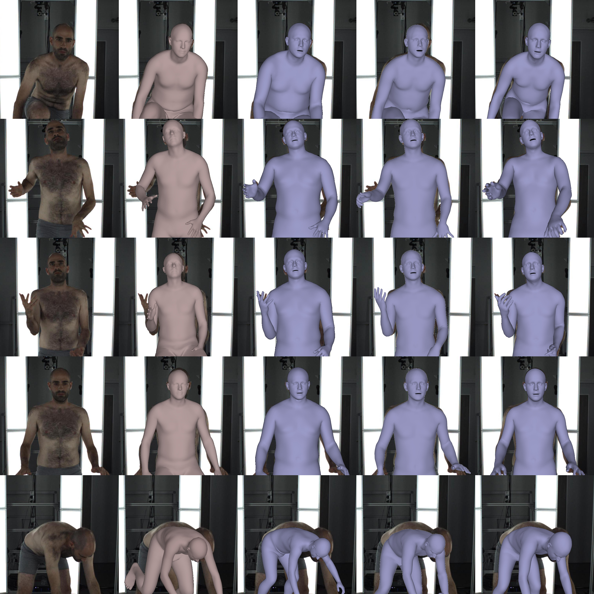
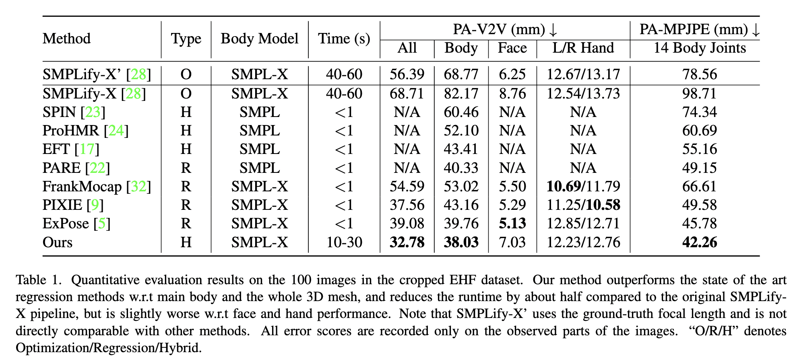

## Towards Robust 3D Body Mesh Inference of Partially-observed Humans

[[Paper](https://drive.google.com/file/d/1LG8N73rY9w-GD86RvLNflcT33Y197mlN/view?usp=sharing)]
[[Slides](https://drive.google.com/file/d/19S5DjymdJS-5VcZ5PIo2FsS-Z1QqukUm/view?usp=sharing)]


Qualitative evaluation on video captures of partially-observed humans in *Star Trek: The Next Generation*. From left to right: input image, 
[ExPose](https://expose.is.tue.mpg.de), [PIXIE](https://pixie.is.tue.mpg.de), ours.

## Description

This repository contains the fitting and evaluation code used for the experiments in <strong>Towards Robust 3D Body Mesh Inference of Partially-observed Humans</strong>.

## Keypoints Blending
[OpenPose BODY_25 format](https://cmu-perceptual-computing-lab.github.io/openpose/web/html/doc/md_doc_02_output.html#pose-output-format-body_25)|[MMPose Halpe format](https://mmpose.readthedocs.io/en/latest/topics/wholebody.html#topdown-heatmap-hrnet-dark-on-halpe)                      |Blending
:----------------------------:|:----------------------------:|:----------------------------:
  |    |

We perform confidence calibration to blend keypoint detection results from two detectors: [OpenPose BODY_25 format](https://cmu-perceptual-computing-lab.github.io/openpose/web/html/doc/md_doc_02_output.html#pose-output-format-body_25) and [MMPose Halpe format](https://mmpose.readthedocs.io/en/latest/topics/wholebody.html#topdown-heatmap-hrnet-dark-on-halpe). The per-keypoint heuristics on the [SHHQ dataset](https://stylegan-human.github.io/) as mentioned in the paper can be downloaded [here](https://polybox.ethz.ch/index.php/s/UHTisMSR5RzMi0X).

We provide a colab notebook for keypoints blending and visualization: [](https://colab.research.google.com/drive/1qJ-eeTDFdQLXR5vH98z_Gg4EgFGJfHCB)

## Dependencies

Follow the installation instructions for each of the following before using the fitting code. For some of the components, please install our modified version that have been adapted and tested for our optimization pipeline.

1. [PyTorch](https://pytorch.org/)
2. [SMPL-X](https://github.com/xiyichen/smplx)
3. [VPoser](https://github.com/nghorbani/HumanBodyPrior)
4. [Trimesh](https://trimsh.org/) for loading triangular meshes
5. [Pyrender](https://pyrender.readthedocs.io/) for visualization

### Optional Dependencies

1. [PyTorch Mesh self-intersection](https://github.com/xiyichen/torch-mesh-isect) for interpenetration penalty 
   * Download the per-triangle part segmentation: [smplx_parts_segm.pkl](https://owncloud.tuebingen.mpg.de/index.php/s/MWnr8Kso4K8T8at)
2. [Homogenus](https://github.com/xiyichen/homogenus) for gender classification
3. [ExPose](https://github.com/vchoutas/expose) to use its predictions as prior / initialization
4. [PIXIE](https://github.com/YadiraF/PIXIE) to use its predictions as prior / initialization

## Fitting 
Run the following command to execute the code:
```Shell
python smplifyx/main.py --config cfg_files/fit_smplx.yaml 
    --data_folder DATA_FOLDER 
    --output_folder OUTPUT_FOLDER
    --gender GENDER
    --visualize="True/False"
    --model_folder MODEL_FOLDER
    --vposer_ckpt VPOSER_FOLDER
    --interpenetration="True/False"
    --part_segm_fn smplifyx/smplx_parts_segm.pkl
    --save_vertices="True/False"
    --focal_length=FOCAL_LENGTH
    --use_gender_classifier="True/False"
    --homogeneous_ckpt HOMOGENUS_PRETRAINED_MODEL_FOLDER
    --expose_results_directory EXPOSE_RESULTS_FOLDER
    --pixie_results_directory PIXIE_RESULTS_FOLDER
    --regression_prior='combined/ExPose/PIXIE/PARE/None'
```
where the `DATA_FOLDER` should contain two subfolders, *images*, where the images are located, and *keypoints*, where the OpenPose output should be stored. 

If `use_gender_classifier` is set to True, `homogeneous_ckpt` should contain the path to the pre-trained model of the gender classifier [Homogenus](https://github.com/nghorbani/homogenus). If it's set to False, a gender flag `--gender='male/female/neutral'` should be used. The gender predictions aren't very accurate for aggresive truncations and low-resolution images. For such cases, we recommend inputting the gender determined by human.

For aggressive trunctions in video captures or social media images, the focal length approximation mentioned in the paper could also be inaccurate. In such cases, it is recommended to test different focal length values.

If you would like to use the combined body prior as proposed in the paper, you need to set `expose_results_directory` as the directory of ExPose prediction results and `pixie_results_directory` as the directory of PIXIE prediction results.

We provide a colab notebook with all required dependencies for fitting: [](https://colab.research.google.com/drive/1DboPEEQQTJcHooNiBQ-gNRIo7p0o8t_8#scrollTo=sCUaBPKN7KbX)

In addition, two samples from the cropped EHF dataset with blended keypoints, ExPose and PIXIE prediction results are provided [here](https://github.com/xiyichen/smplify-x-partial/tree/master/demo) that allows you to reproduce the results in our paper. Disclaimer: the EHF dataset is for research purpose only. The entire dataset can be downloaded [here](https://smpl-x.is.tue.mpg.de/download.php) after a regrestration.

## Evaluation

Qualitative evaluation on the cropped EHF dataset. From left to right: input image, [PARE](https://pare.is.tue.mpg.de/), [ExPose](https://expose.is.tue.mpg.de), [PIXIE](https://pixie.is.tue.mpg.de), ours.



To perform quantitative evaluation on the cropped EHF dataset, check out `smplifyx/eval.py`. The data required for evaluation, including vertex indices for different body parts, bounding boxes we used to crop the EHF dataset, and the weights for vertex-to-14-joints regressor can be downloaded [here](https://polybox.ethz.ch/index.php/s/2Ii1wdb3Hei7aba).

## Acknowledgement & Citation
This work is a Master's semester project at [Computer Vision and Learning Group (VLG), ETH Zurich](https://vlg.inf.ethz.ch/) by Xiyi Chen and supervised by [Dr. Sergey Prokudin](https://vlg.inf.ethz.ch/team/Dr-Sergey-Prokudin.html). The code is built on [SMPLify-X](https://github.com/vchoutas/smplify-x). If you find this work useful for your research, please consider citing:
```
@misc{smplify_x_partial,
  title = {Towards Robust 3D Body Mesh Inference of Partially-observed Humans},
  howpublished = {\url{https://github.com/xiyichen/smplify-x-partial}},
  author = {Chen, Xiyi and Prokudin, Sergey},
}

@inproceedings{SMPL-X:2019,
  title = {Expressive Body Capture: 3D Hands, Face, and Body from a Single Image},
  author = {Pavlakos, Georgios and Choutas, Vasileios and Ghorbani, Nima and Bolkart, Timo and Osman, Ahmed A. A. and Tzionas, Dimitrios and Black, Michael J.},
  booktitle = {Proceedings IEEE Conf. on Computer Vision and Pattern Recognition (CVPR)},
  year = {2019}
}
```
